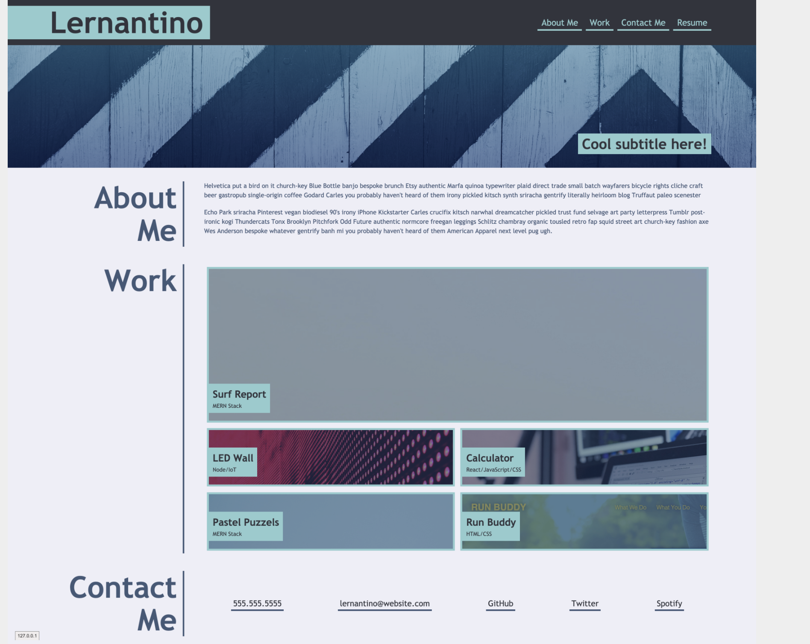
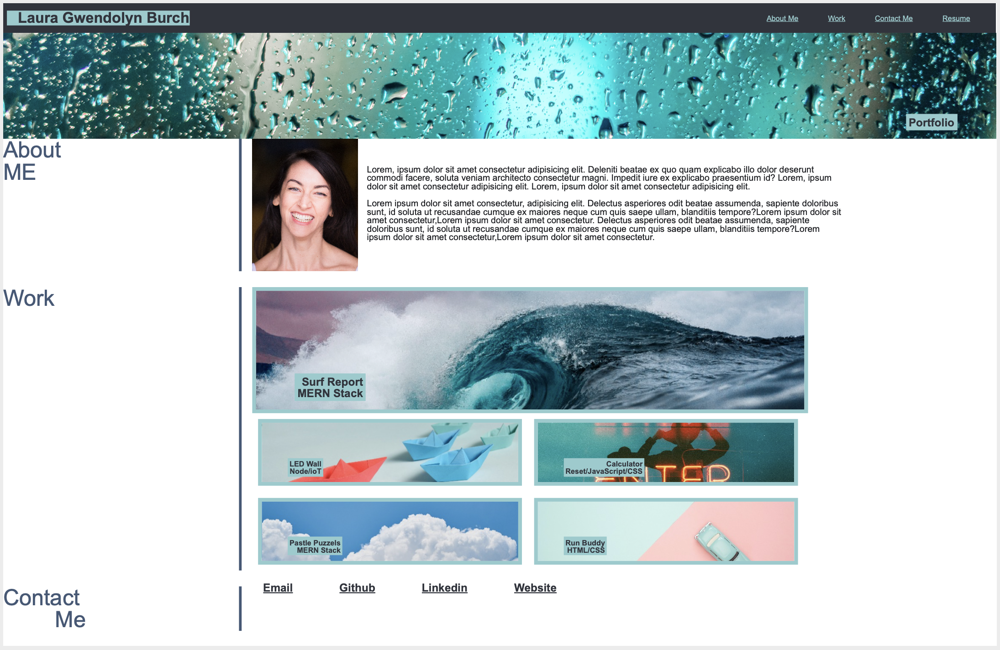
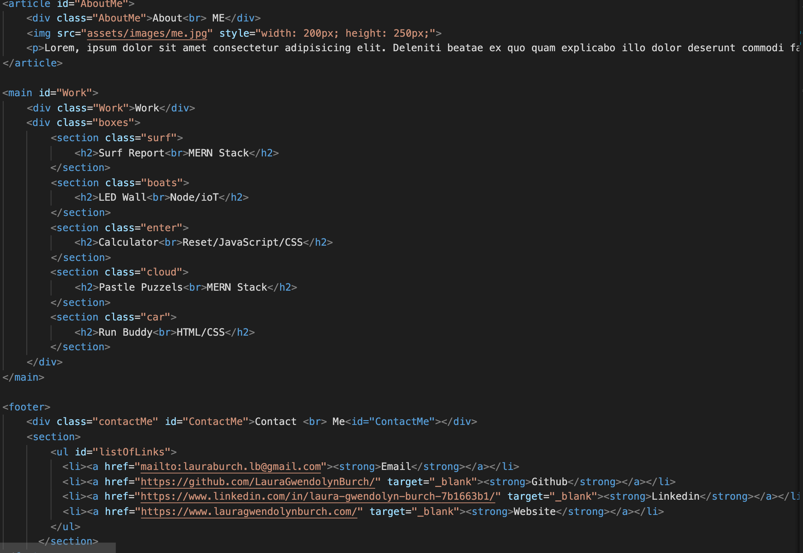
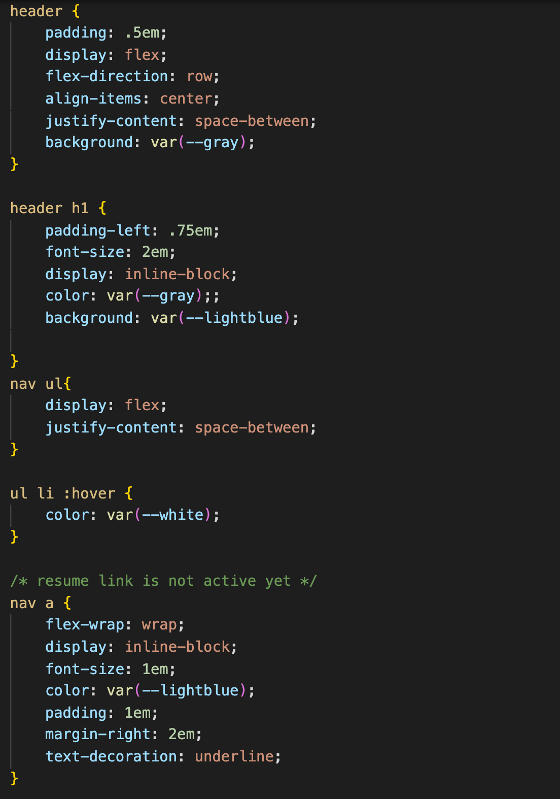

# Coding-Creation-Portfolio

## Description
The concept here is to mimic a currrent website's application appearance and functionality.  The design mock-up will be used to showcase current and future skills as a developer.  This will serve as a placeholder for applications as they are developed. 

## CSS Applications Highlights
* flexbox
* background images
* hover
* design elements 

## HTML highlights
* href links
* image links
* ui scrolls to corresponding section

## Link to Project 
[Coding Creation Portfolio](http://www.lauragwendolynburch.github.io/coding-creation-portfolio/)

### Example Webpage

### MY Webpage

### Sample HTML

### Sample CSS

## User Notes
This was wildly challenging to me. I am 100% new to coding.  I spent over 30 hours on the original project.  I finally had to put it down and take a break.  I would still like to rework and clean up the css and add media queries. Some of my formatting in my main is not where I would like it to be, and of course the are no links in the work section...yet! I am excited to see what I will be able to do with this in the future.   
